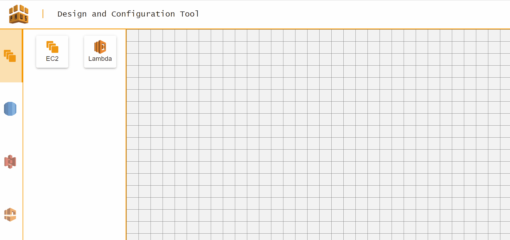
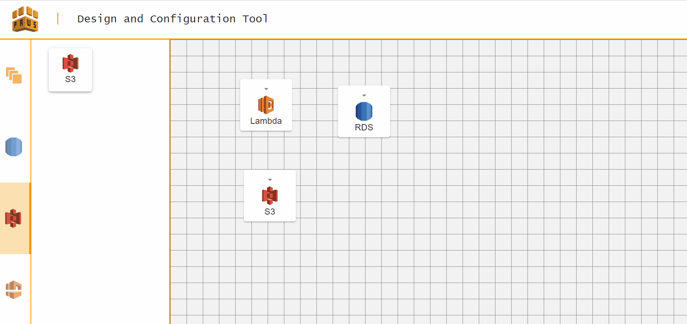
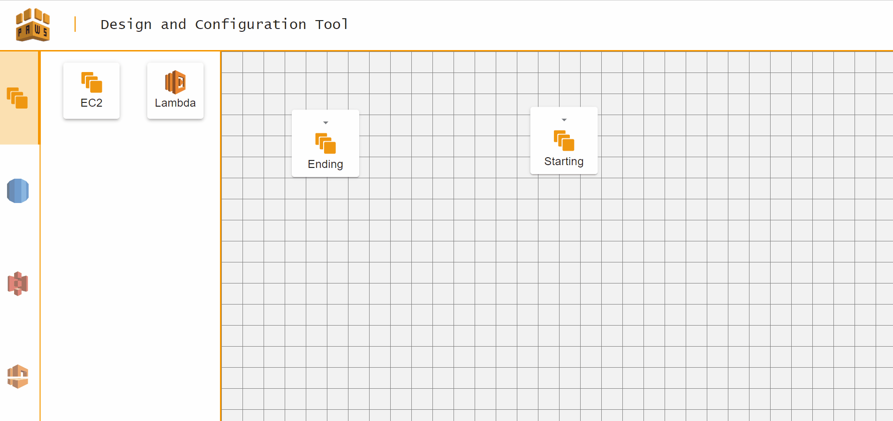
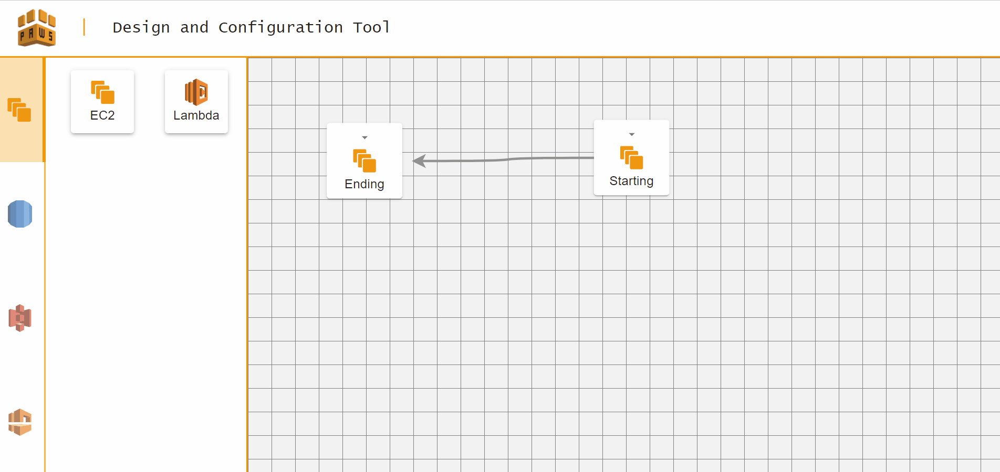
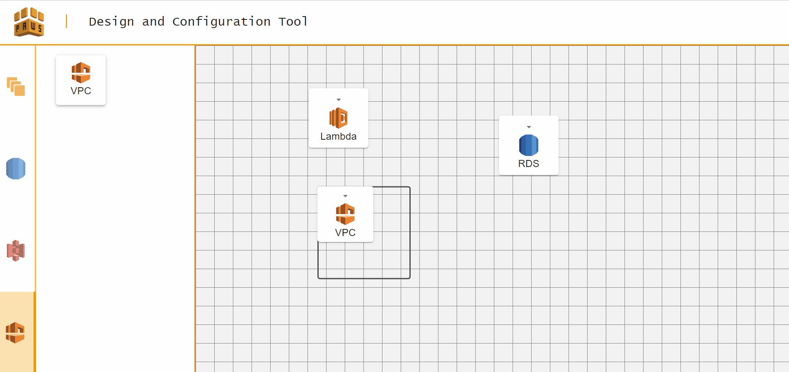
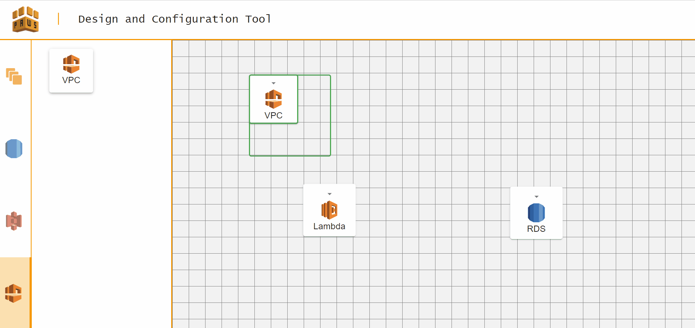
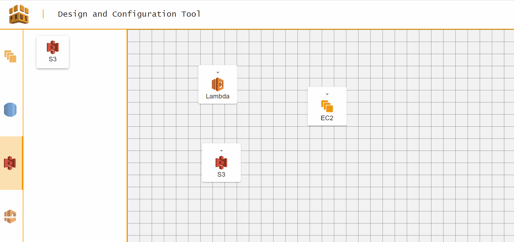

# pAWS | Application Configuration Tool

<br/>

<p align="center">
  
</p>


<br/>
<br/>

ReactJS application which allows users to quickly create their application's architecture diagram and specify their configuration. This tool put security at the forefront and also allows users to select what AWS Managed Rules they want to be guided by.

<br />

## Table of Contents
1. [Developer Guide](#developer-guide)
    1. [How to run](#how-to-run)
    2. [Running with Docker](#running-with-docker)
    3. [Using eslint](#using-eslint)
    4. [Deployment](#deployment)
2. [User Guide](#user-guide)

<br />

---

## Developer Guide

### How to run:
1. Change into the correct directory - ```cd ./```
2. Ensure that there isn't an existing node_modules by running ```rm -rf node_modules```
3. Install the required node modules - ```npm install```
4. Start the app - ```npm start```
5. The app should be runnning on ```localhost:3000```

### Running with Docker:
1. Install Docker on your machine by following this [guide](https://docs.docker.com/desktop/)
2. Change to the root directory - e.g. webapp-frontend
3. Run docker-compose to built the image and start the container
    ```
    docker-compose up
    ```
3. If you make changes, ensure you rebuild the image to see the changes by running:
    ```
    docker-compose up --build
    ```

### Using eslint:
Eslint is a linter that can help to tidy up your cody and ensures everyone working on the project is practicing the same coding standards. It helps to make the code readable and easy for everyone to understand.

#### Checking for errors:
    npx eslint ./src

#### Fixing all auto-fixable errors:
    npx eslint ./src --fix


### Deployment
The tool has been deployed onto AWS using AWS Amplify. To deploy, follow the steps below:

1. Run the below command in the repository's directory.
    ```    
    cd ./
    set DISABLE_ESLINT_PLUGIN=true
    npm run build
    ```
2. Go to the AWS Console and navigate to the AWS Amplify dashboard
3. Click <b>New app</b> and <b>Host web app</b>
4. Select <b>Deploy without a Git provider</b>
5. Drag and drop your ```./build``` directory into the Console
6. Select <b>Save and Deploy</b>
7. Your app should be ready to access now!

---

## User Guide

The application is based on a simple drag-and-drop functionality. The resources represent the AWS instances and services that make up the system. The connections represent the data flows or linkages between the instances.

Basic functionality and usage is outlined below.

### Adding and Removing Resources

To add resources, drag a resource tile from the asset bar on the left onto the canvas.

<p align="center">
  
</p>

To remove resources, click on the resource you wish to remove - a green outline should appear. Then press the `BACKSPACE` or `DELETE` keys to remove the resource.

<p align="center">
  
</p>


### Adding and Removing Connections

To add a connection, hover over the starting resource so that the connection handlers appear. Then, drag one of the handlers over to the ending resource and drop it. A connection should appear between the two resources.

<p align="center">
  
</p>

To remove a connection, click on the connection you wish to remove - it's colour should change to green. Then press the `BACKSPACE` or `DELETE` keys to remove the connection.

<p align="center">
  
</p>

### Moving and Resizing Resources

Resources can be moved around the canvas by simply dragging and dropping them.

<p align="center">
  
</p>

Resources can be resized from any one of the 4 corners by dragging the resize handlers as shown below.

<p align="center">
  
</p>

### Configuring Resources

Each resource type has a specific list of configurable options that are available in the Configuration Panel. The Panel is accessible via the arrow located on each resource tile.

<p align="center">
  
</p>

Once the resource has been configured, the CloudFormation template and Conformance Pack can be retrieved and downloaded by pressing the `Submit` button at the bottom.

<p align="center">
  
</p>

### Using the Dependency Checker Tool

The Dependency Checker Tool is available for Compute resources in the Configuration Panel. Users can enter the names of the packages to be checked as well as the depth of the dependency tree that they wish to check up to. Results will then be listed in the panel.

<p align="center">
  
</p>

